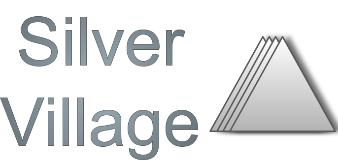

#  is213-project #

##  IS213 - Silver Village ##

duncanleo  
Syafahani  
Defactor213  
syafiqbs  
gailteh  
Wongjuda  

##  Project Overview ##
<!-- * Describe your project. What is it called? What does it do? Why did you make this web application? Who will benefit from using your web application? Describe your users - who are they? (anyone? or specific target age group or gender? region? country?) -->

In this project, we aim to build a Cinema application to simulate the activities of a real cinema. Users are offered the latest shows available at real cinemas, and are able to create and account and book tickets for movies. There will be admin access as well to track sales revenue and seat bookings. This serves as an effective way for the team to practice using microservices and various libraries and frameworks.
 
 

### Development
1. Run `docker-compose build`
2. Run `docker-compose up`

### Available services
- Frontend (http://localhost:3000)
- Kong API Gateway (http://localhost:8000)
    - Auth (/login, /signup, /me, /healthz)
    - Bookings (/bookings)
    - Movies (/movies)
    - Rating (/rating)
    - Trailer (/trailer)
- RabbitMQ 
    - Management (http://localhost:15672)
    - Notifications
- Zipkin Tracing (http://localhost:9411)

## System Architecture Diagram ##

    
## How to Install and Run Our Web Application (for Developers) ##
1. Create accounts and keys for the TMDB and STRIPE services, and insert them into `.env` file

    a. STRIPE_KEY = 
   
    b. TMDB_API_KEY = 
2. Run `docker-compose build` followed by `docker-compose up`
3. The website will now be up and running on localhost:3000
4. manager account can be accessed with username: manager, password: manager

##  Libraries and Frameworks used##
Front-end: Next.JS, React.JS
GO: Gin-Gonic, GORM 
TypeScript: Koa, Prisma
Python: Flask
Additional libraries and frameworks: Zipkin, Kong, Redis
